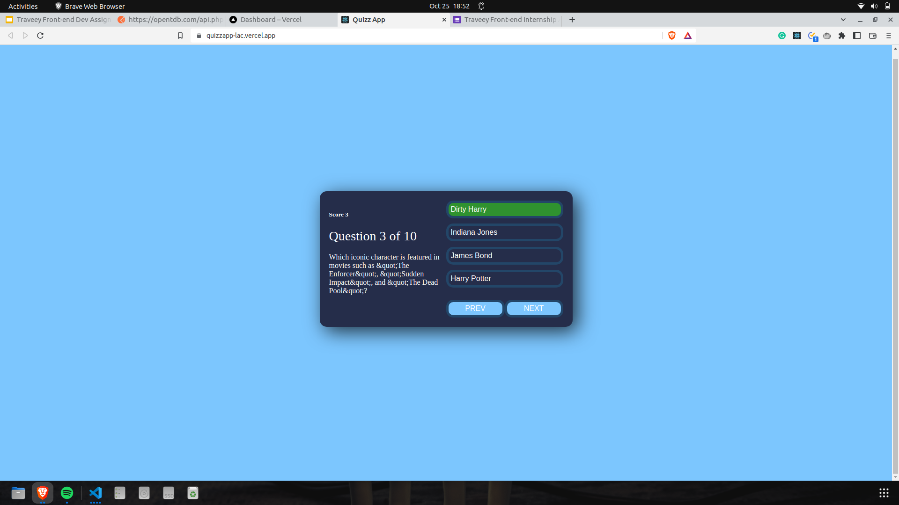
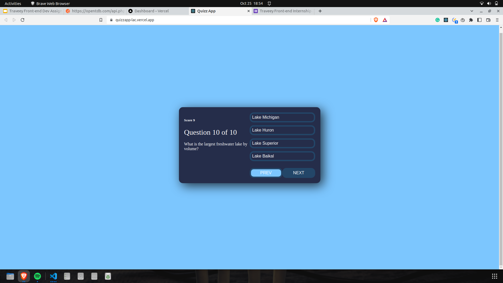

<h1 align="center">
   <a href="https://github.com/anuprajvarma/Quizz_App">
      Quizz App
   </a>
</h1>

<p align="center">
    It's a quizz application that lets you play fully customized quizzes right in the browser.
</p>




## Built With

- [React](https://reactjs.org/)
- [Javascript](https://www.w3schools.com/js/)
- [CSS](https://www.w3schools.com/css/)
- [API](https://opentdb.com/api.php?amount=10)

## Development

To get a local copy of the code, clone it using git:

```
git clone https://github.com/anuprajvarma/Quizz_App.git
cd quiz_app
```

Install dependencies:

```
npm install
```

Now, you can start a local web server by running:

```
npm start
```

And then open http://localhost:3000 to view it in the browser.

#### Available Scripts

In this project, you can run the following scripts:

| Script        | Description                                                             |
| ------------- | ----------------------------------------------------------------------- |
| npm start     | Runs the app in the development mode.                                   |
| npm test      | Launches the test runner in the interactive watch mode.                 |
| npm run build | Builds the app for production to the `build` folder.                    |
| npm run eject | This command will remove the single build dependency from your project. |
